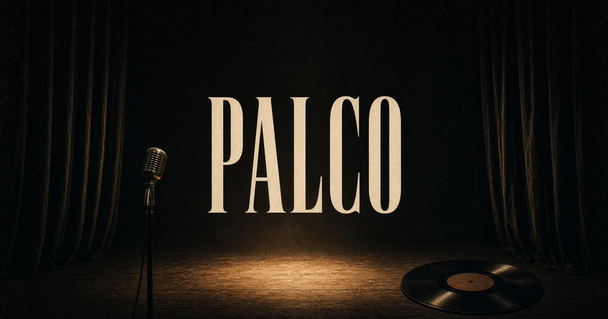

# Palco

Estúdio de visualizers animados em **1920×1080**. Foto de fundo, peças em PNG, looping por camada e exportação em vídeo — pensado para clips, cortes e capas de música.

**Abrir o Palco:** [editorpalco.grok.me](https://editorpalco.grok.me)



## O que é

O Palco é um palco virtual: você monta a cena, escolhe como cada peça se mexe e grava o resultado no tamanho certo para o YouTube.

- Fundo em 16:9 (1920×1080), com encaixe *cover*
- PNGs arrastáveis, com escala, opacidade, espelho e ordem de camadas
- Looping por peça: vibrar, balançar, girar e mais de 20 movimentos
- Sliders de intensidade, velocidade e reação ao grave
- Música importada (Web Audio) com spectrum opcional
- Gravação do palco em WebM/MP4 + exportação de um quadro PNG
- Cena salva no navegador (IndexedDB)

Tudo roda no browser. Não precisa de conta.

## Como usar

O estúdio está em [https://editorpalco.grok.me](https://editorpalco.grok.me).

1. **Fundo** — envie uma foto 1920×1080 ou escolha *Palco vazio* / *Bokeh*.
2. **Peças** — clique num sticker do pacote ou envie o seu PNG. Arraste no palco; os cantos redimensionam.
3. **Looping** — selecione a peça e escolha o movimento. O slider de **intensidade** controla o quanto ela se mexe; **velocidade** o ritmo; **áudio** quanto o grave empurra.
4. **Música** — importe um áudio. Modos como *Batida* e *Pop* reagem ao grave.
5. **Gravar** — captura o palco (e a faixa, se estiver tocando). **Quadro** baixa um PNG 1920×1080 do frame atual.

No telemóvel, peças, animação e camadas ficam nas abas de baixo.

### Mistura

Cada camada pode usar *Normal*, *Tela*, *Soma*, *Overlay* ou *Multi* — útil para halos, faíscas e anéis sobre a foto.

## Loopings

| Movimento   | O que faz                         |
| ----------- | --------------------------------- |
| Parado      | Sem looping                       |
| Vibrar      | Treme no lugar                    |
| Balançar    | Oscila como um pêndulo            |
| Girar       | Rotação contínua                  |
| Pulsar      | Cresce e diminui                  |
| Flutuar     | Sobe e desce suave                |
| Quicar      | Bounce elástico                   |
| Órbita      | Circula em volta                  |
| Glitch      | Cortes digitais                   |
| Onda        | Desliza em seno                   |
| Piscar      | Pisca a luz                       |
| Pêndulo     | Balança preso no topo             |
| Respirar    | Lento, vivo                       |
| Batida      | Reage ao grave da música          |
| Infinito    | Percorre um 8                     |
| Zoom        | Aproxima e afasta                 |
| Deriva      | Flutua à deriva                   |
| Eco         | Deixa rastros                     |
| Giro-treme  | Gira e treme                      |
| Coração     | Pulso duplo                       |
| Slide       | Vai e volta                       |
| Espiral     | Entra em espiral                  |
| Pop         | Estoura na batida                 |
| Tilt        | Inclina em 3D                     |
| Caleido     | Gira e muda a cor                 |

## Atalhos

| Tecla        | Ação                |
| ------------ | ------------------- |
| Espaço       | Tocar / pausar      |
| Delete       | Remover peça        |
| Ctrl/Cmd + D | Duplicar            |
| Ctrl/Cmd + Z | Desfazer            |
| Setas        | Empurrar (Shift × 8) |
| `[` `]`      | Ordem das camadas   |

Solte um PNG, uma foto ou um áudio em cima do palco para importar.

## Pacote de peças

Vinil, fones, microfone, fita, caixa, faísca, anéis, nota, raio e halo — prontos para usar, com transparência.

## Stack

- React 19 + TanStack Start + Tailwind v4
- Canvas 2D (composição em 1920×1080)
- Web Audio (`AnalyserNode`) para grave / batida / spectrum
- `MediaRecorder` + `captureStream` para o vídeo
- Zustand + IndexedDB para o projeto

## Desenvolvimento

Requer Node 22.

```bash
npm install
npm run dev
```

O estúdio sobe em `http://localhost:8080`.

```bash
npm run typecheck
npm run build
```

O palco interno é sempre 1920×1080; a UI só escala a pré-visualização. A gravação sai nesse tamanho.

## Estrutura

```
src/components/editor/   UI do estúdio (palco, peças, inspector, transporte)
src/lib/visualizer/      motor: animações, áudio, render, gravação, persistência
public/backgrounds/      fundos 1920×1080
public/overlays/         PNGs e SVGs do pacote
```
